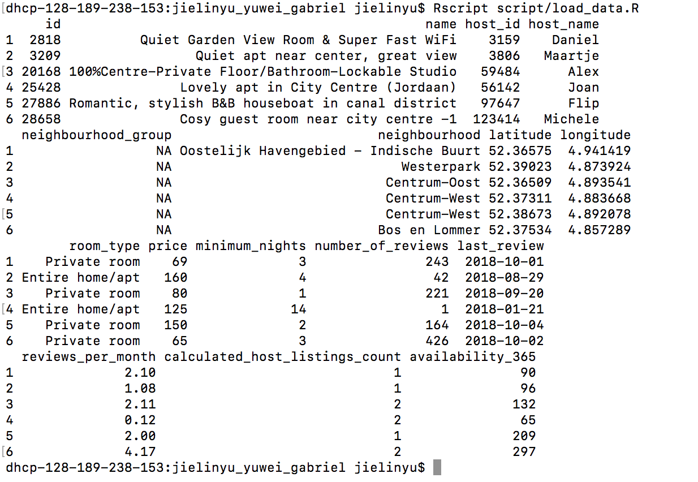

# jielinyu_yuwei_gabriel

This is the project of MDCI-552 from Jielin Yu, Yuwei Liu, and Gabriel Bogo.
=======
## Data 

- Source: 
[Website](http://insideairbnb.com/get-the-data.html)
[File](http://data.insideairbnb.com/the-netherlands/north-holland/amsterdam/2018-10-05/visualisations/listings.csv)

- content
Summary information and metrics for listings in Amsterdam

## Proof of Loading Data

## Questions:

- What are the strongest predictors of price for airbnb listings in Amsterdam ?

- Type of Question: Predictive 

## Plan 

- We believe two following techniques can help us answer this question 
  1. Multiple linear regression
  2. Decision tree regression
  
  
 
## Summarization and Visualization 

 We will clean and filter the data and summarize the data as 5-number summary table. 
 We will make a map to visualize prices over different neighborhoods. 
 We will make multiple scatterplots to show different feature relationships with prices. 

