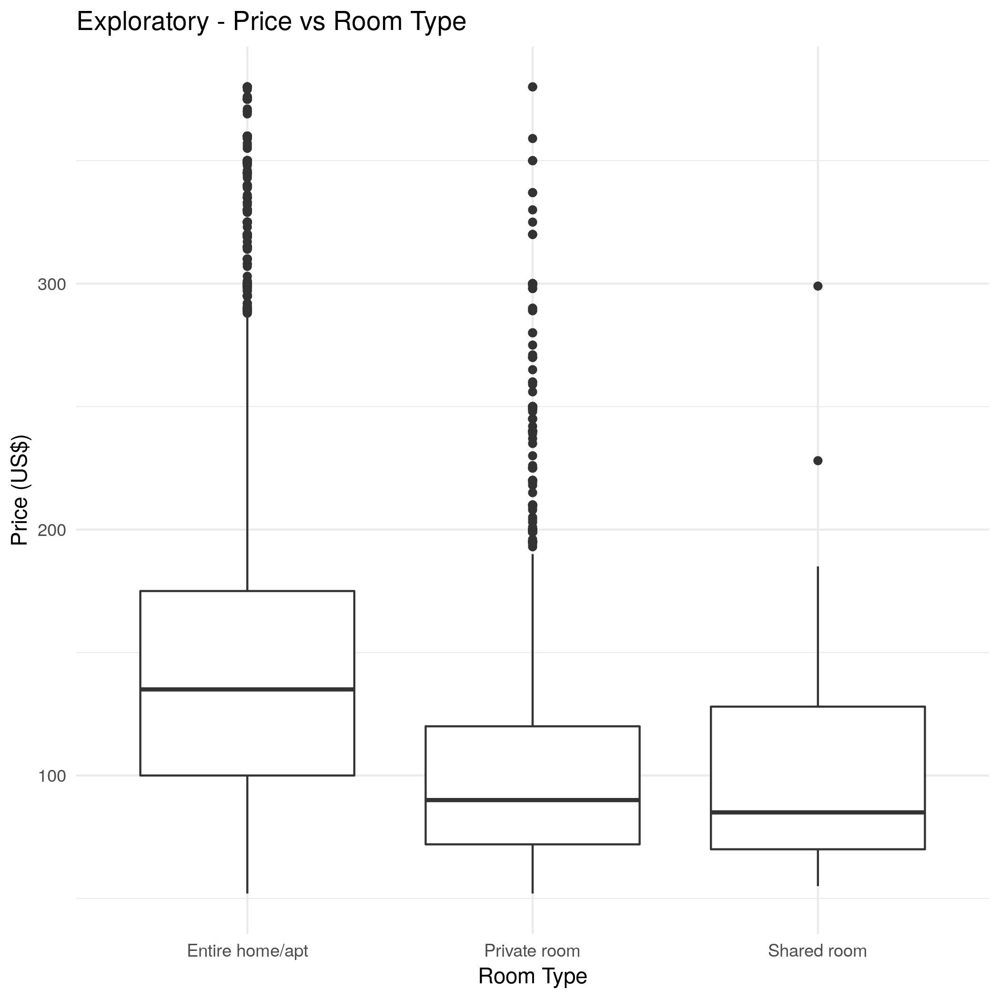
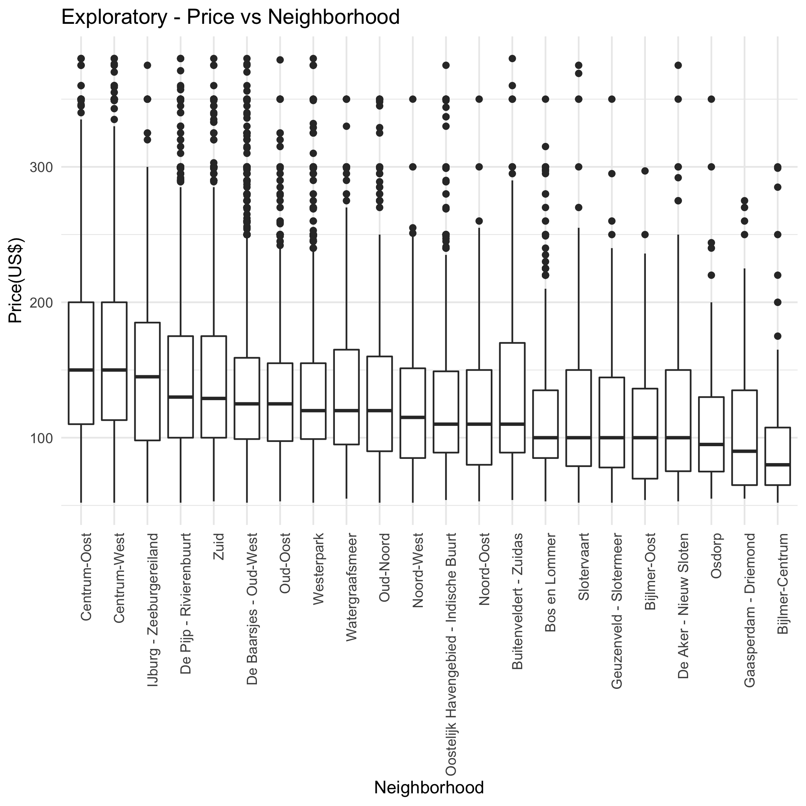

```{r setup, include=FALSE}
library(tidyverse)
library(here)
knitr::opts_chunk$set(echo = TRUE)
knitr::opts_knit$set(root.dir = here())
```

##Airbnb in Amsterdam!

  Airbnb renting has always been interesting. Some spots can be rented in higher prices, whereas other spots can only be rented in very low prices. 
  Suppose you would like to be a host in Amsterdam - in order to be a successful host, it is a good idea to investigate the host listing data from airbnb and see what are the major predictors of the room prices. In this project, we are going to do this job for those who want to be a successful host! Therefore, in our project, a question that is reasonable to ask is: What are the two strongest predictors of price for airbnb listings in Amsterdam? We are going to analyse the host listing data in Amsterdam and find out the answer! 

##Analyzing and Prediction

  From the [Website](http://insideairbnb.com/get-the-data.html), we found the host listing data of Airbnb in Amsterdam. Before starting analyze the data, let's take a look at the data. 

```{r}
data=read.csv("data/amsterdam_listings.csv")
knitr::kable(head(data))
```


From the data, we can see that there are several features inside: 


| Column name | Description |
| --------------------------------- |------------------------------------------------------------------------------------------------- |
|id | Unique identification code for the listing. |
|name | Descriptive name of the listing. |
|host_id | Unique identification code for the host. |
|host_name |First name of the host (privacy is respected. The data is open.) |
|neighbourhood | A categorical character variable that specifies the name of neighbourhood of the listing. |
|latitude | A numeric variable that combining the **longitude** to represent the location of the listing. |
|longtitude | A numeric variable that combining the **latitude** to represent the location of the listing. |
|room_type | A categorical variable including **Shared Room**, **Private Room** or **Entire Room/Apt**. |
|price | The price of the listing. |
|minimum_nights | The minimum number of nights the host requires to book their property. |
|number_of_reviews | Number of customer reviews regarding the listing. |
|last_review | Date of the last review. |
|reviews_per_month | Number of customer reviews per month. |
|calculated_host_listings_count | Number of listings each host has simultaneously. |
|availability_365 | The number of days that the listing is available in a 365 days, which is pre-defined by the host. |


  After looking at the data, we predict that `neighbourhood`, `location(latitude and longtitude)`, `room_type`, `minimum_nights`, `number_of_reviews`, `reviews_per_month`, `calculated_host_listings_count`, and `availability_365` can possibly be the factors affecting the price. In order to find out the two strongest predictors, after cleaning the data, we are going to perform some exploratory data analysis to tray and have a grasp of these factors visually, then use a decision tree algorithm to find out the two strongest predictors. 
  

## Data cleaning
  
  After taking a look of these features, we realized that `neighbourhood` and `location(latitude and longtitude)` could act similarly in affecting the room price, as well as `reviews_per_month` and `number_of_reviews`. `Latitude and longitude` pairs are a more complicated feature than `Neighbourhood`, since it contains two continuous variables that must be combined to carry any meaning. At the moment, we haven't learned how to combine two features into one and implement it in the decision tree. Therefore, at this time, we decide not to use these two features. For `reviews_per_month` and `number_of_reviews`, when we first looked at the data, we believed that `reviews_per_month` is a better feature to use than `number_of_reviews` because it is possible that some listings have more reviews simply due to the fact that they're on airbnb longer than others. However, when we took a deep look, we found out that there are more than 2000 missing values in the `reviews_per_month`, therefore, we decided to use `number_of_reviews` instead. We also cleared out some outliers in `minimum_nights`.
  
## Data Visualization

In this section, we are going to explore if each feature affects the price by visualizing it. 

The first one we are going to look at is the relationship between number of reviews of a listing and its price. 
  

Figure 1: Relationship between the Number of Reviews per Listing and Price.

Based on our experience, AirBnb reviews are unbalanced toward positive appraisals. Negative reviews are actually not that common, maybe because after a few negative reviews, no one else will rent that place. Therefore, we would think that a higher number of reviews would make the listing more reliable, allowing the host to charge a higher price for that. That's not what we see, though. From the graph above, there is no clear positive trend between price and number of reviews. There can still be a combined effect with other features, but are not sure if it is a strong predictor yet.
  
The second one we are going to look at is the relationship between minimum nights the host requires for a listing and its price.
  

Figure 2: Relationship between Minimum number of nights host requires and price.

  From this graph alone, even though there seems to be an upward trend, we cannot rule out the possibility that the price goes down if the minimum number of nights increase, which would make sense in a "bulk sale" perspective. Maybe this is true only within certain clusters of home/room types, and could be captured by an interaction term. On the other hand, we cannot say that there is a clear relationship either. Therefore, from this graph, we cannot be sure whether the minimum number of nights is a predictor of the price. 

The third one we are going to look at is the relationship between the room type of a listing and its price. 


Figure 3: Comparision of the maximum, minimum, 25% percentile, median, and 75% percentile of prices for different room types.

  From this graph, we can see that the median of `Entire home/apt` is much higher than the other two, which is expected since an `Entire home/apt` has generally larger area than a `Private room` and a `Shared room`. What is surprising, though, is to see very little difference between a *private* and *shared* room, given that the former has much better privacy than the latter, especially when we take into account the entire 25%-75% percentile range. All in all, if we only look at the median, we can see that price is influenced by the `room_type`, which looks like a potential predictor of the price.
  
The fourth one we are going to look at is the relationship between the neighbourhood of a listing and its price


Figure 4: Comparision among different neighbourhood on the maximum, minimun, 25% percetile, median, and 75% percetile of prices
    
  In this graph, we can see there is a clear relationship between the neighbourhood and the median of the prices, which is expected. However, the maximum and minimum prices doesn't change that much as eighbourhood changes. Also, although 25% percentile and 75% percentile of prices decrease in general form left to right, there are some exceptions. For example, the 75% percentile of prices in `Buitenbeldent-Zuidas` is higher than some of its left conterparts. However, if we only consider the median of the prices, we can say that neighbourhood can be a predictor of the price. However, again we don't know if it will be a strong predictor.
  

The fifth one we are going to look at is the relationship between the number of listings that listing host has and the price of that listing.
  

Figure 5: Relationship between the number of listings the host has and the price

  From the graph, we can see there is no strong correlation between the number of listings a host has and the price. Although there are more highly priced listings when the number of listings a host has is small, that is probably because there are more listings that have the host having low number of listings. 


The last one we are going to look at is the relationship between the number of availability per 365 days of a listing and the its price.


Figure 6: Relationship between the number of availability per 365 days and the price

  From the graph, we can see that there is no strong correlation between the availability per 365 days and the price, which makes sense because usually number of availability is not related to price in real life.
  
  
  After the exploration, as a result, we found out the slope of every blue line is not high, so most features don't show a strong correlation with the price. we expect `Neighborhood` and `room type` to be the strongest predictors of price, although we will not be testing the former. We are not sure about rest of the features and their possible combined effects.
  
##Decision Tree

  In order to find out the two strongest predictors of price, we are going to make a decision tree and test it out. Thes features that will be tested out are: `room_type`, `minimum_nights`, `number of reviews`, `availability_365`, and `calculated_host_listings_count`. The `neighborhood` variable will be left to be tested in a future time. `room_type` as a categorical variable, will be converted into numeric for modeling. 
  
  We are going to label the price as three levels: `low`,`median`, and `high`, and set it as our response variable. To train the model, we are going to use 80% of the data as training data, and 20% of the data as testing data.
  
  First, in order to get the higher accuracy, we decide to test the accuracy on the hyperparameter `max_depth`. We choose to expriment the value of `max_depth` between 2 and 13 with our training data. After the experiment, we found out that when `max_depth` is 4, the test accuracy is the highest. Therefore, we decide to use `max_depth=4` in this model. 
  
  Next, we use the training data again for fitting the model that has the hyperparameter of `max_depth=4`. After fitting the model, we are going to use this model and our testing data to predict the outputs. This is the decision tree we get:
  

Figure 7: The decision tree we made for analyzing the strong predictors of the price

   After getting the decision tree and outputs from the model, we are going to alculate the accuracy of the outputs by comparing the outputs with the actual outputs we already had in the testing data. The accuracy we came out is *0.482*, which is not high. This could be because all features we analyzed are not really strong predictors of price, which is actually in accordance with the findings in our data visualization.
   
  Still, as the goal of our research, we are going to use this model to find out the most important factors affecting the price. After testing, we found out that `room_type` and `availability_365` are the two strongest predictors of the price. However, due to the low accuracy of this model, we are not very confident about the results. From the results of our decision tree, we are suprised to see that `availability_365` shows up as an important predictor for pricing, since this is different from the results we observed in our data visualization. Since the accuracy of the model is low, it is possible that the results from the decision trees are just less reliable than our intuition and exploratory data analysis.
  
##Conclusion and Limitation
Overall, from the data visualzation, apart from `neighborhood`, we expected `Number of reviews`, and `room type` to be the two strongest predictors. However, from the decision tree, we got `room_type` and `availability_365` as the "winners". Regardless, we are confident that `room_type` is a strong predictor of the price, but we are less sure about the other two. 

We do know that our analysis has limitations. For example, we found out that `neighborhood` could be a strong predictor on pricing, however, due to the complexity of this categorical feature, we decided not to put it in the tree. Also, as mentioned before, we used `number of reviews` instead or `reviews per month`, which means that some listings could simply have more reviews because they are on Airbnb for a longer time. 

For future work on this matter, we expect to explore the geographical attributes of the listings such as neighborhoods and/or distance to downtown to check whether or not they're the strongest predictor of the price of listings.

##References
  Scikit-learn.org. (2018). sklearn.tree.DecisionTreeClassifier — scikit-learn 0.20.1 documentation. [online] Available at: https://scikit-learn.org/stable/modules/generated/sklearn.tree.DecisionTreeClassifier.html [Accessed 24 Nov. 2018].  
  
  Brownlee, J. (2018). Save and Load Machine Learning Models in Python with scikit-learn. [online] Machine Learning Mastery. Available at: https://machinelearningmastery.com/save-load-machine-learning-models-python-scikit-learn/ [Accessed 24 Nov. 2018]. 
  
  Inside Airbnb. (2018). Inside Airbnb. Adding data to the debate.. [online] Available at: http://insideairbnb.com/get-the-data.html [Accessed 24 Nov. 2018].  
  
  
