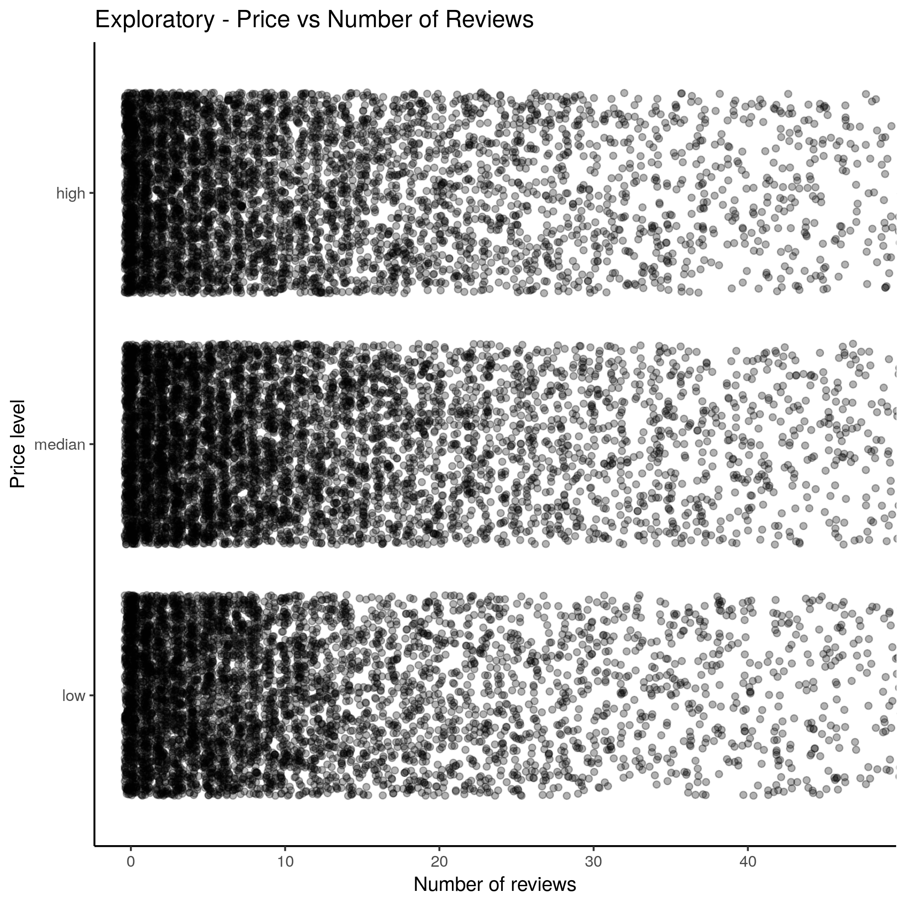
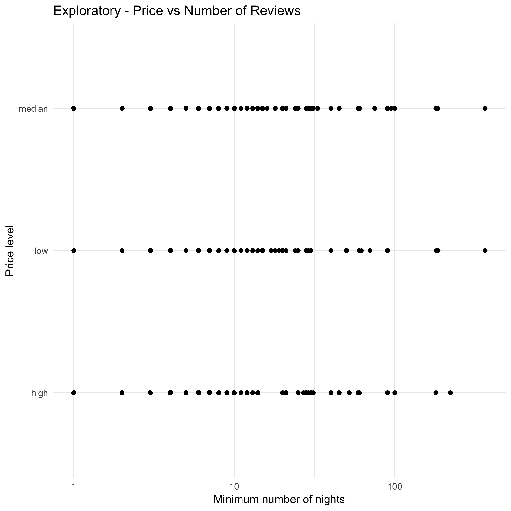
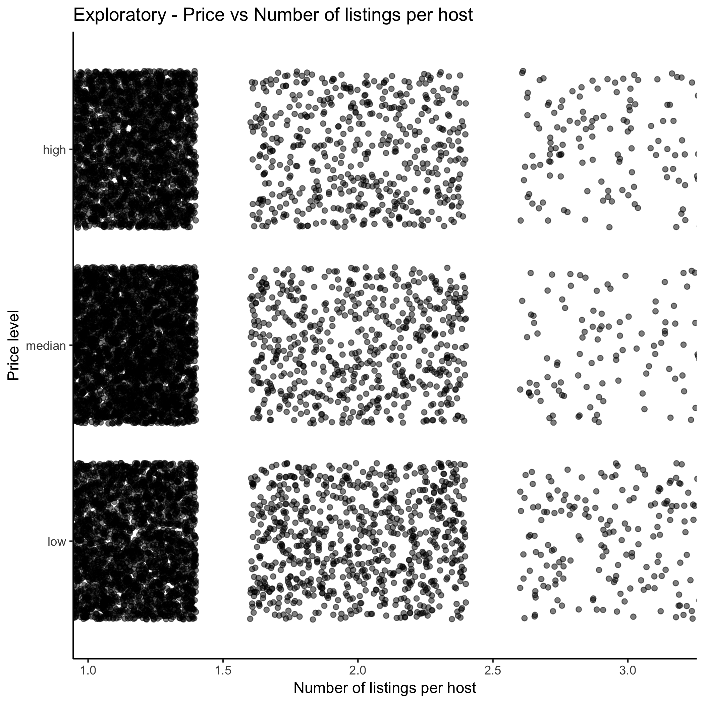
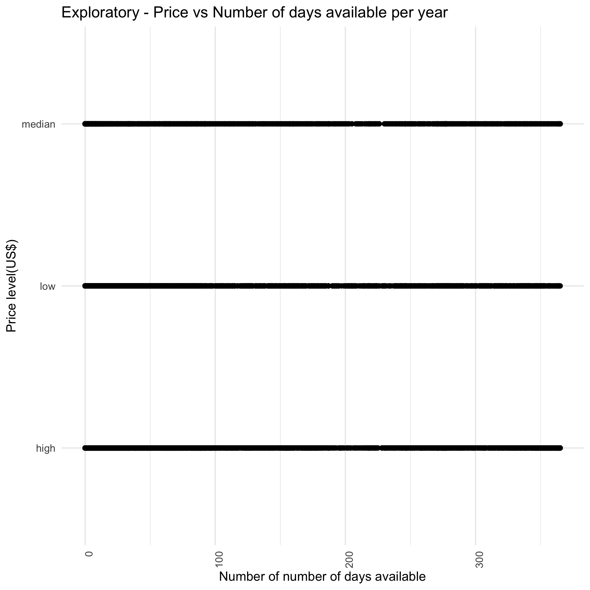
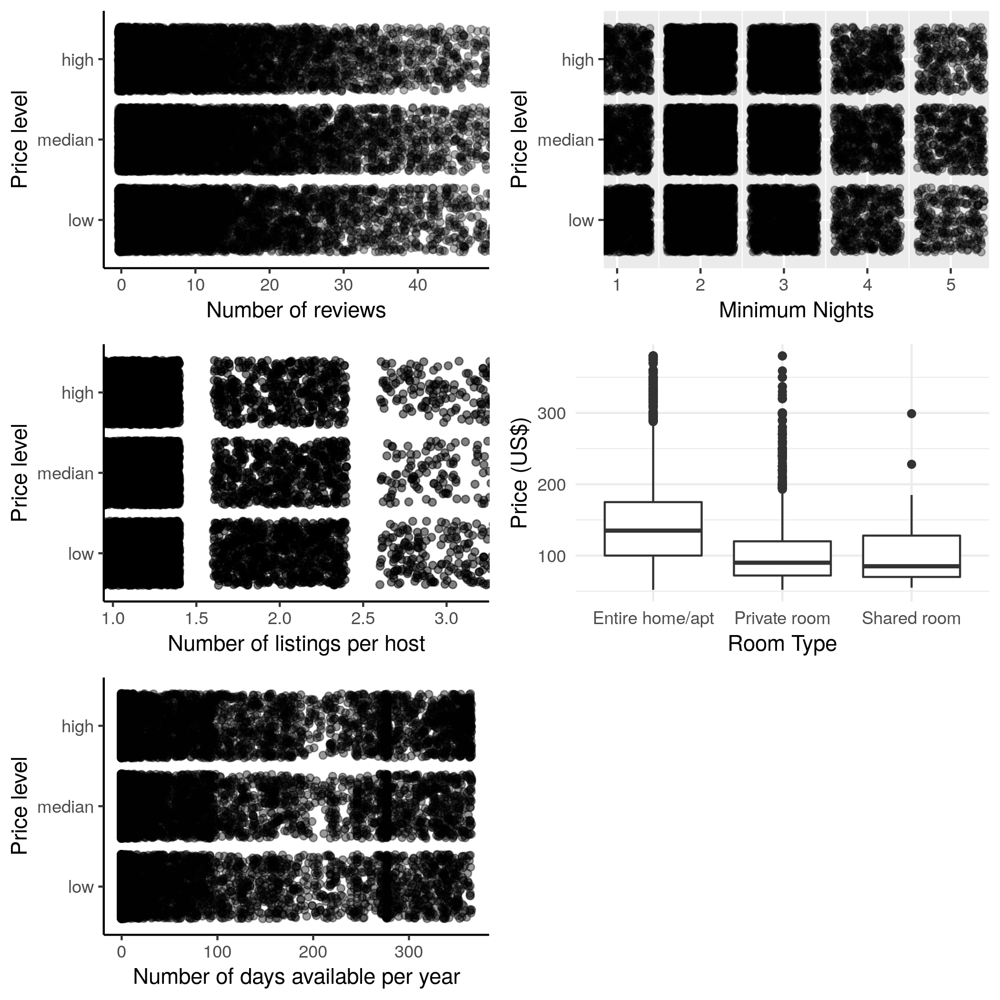
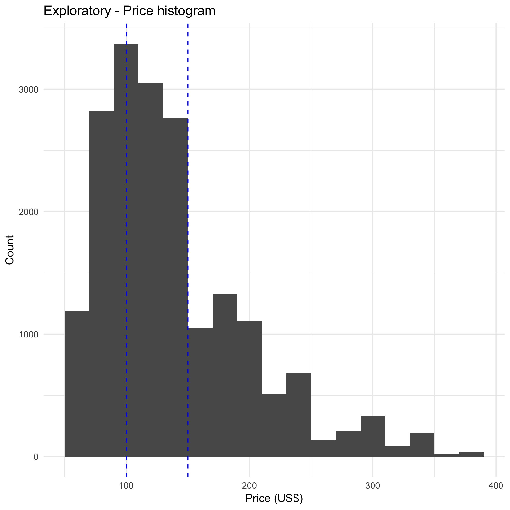
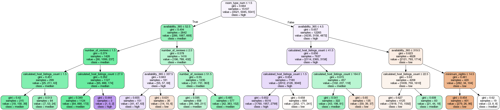

```{r setup, include=FALSE}
library(tidyverse)
library(here)
knitr::opts_chunk$set(echo = TRUE)
knitr::opts_knit$set(root.dir = here())
```

##Airbnb in Amsterdam!

  Airbnb renting has always been interesting. Some spots can be rented in higher prices, whereas others can only be rented in very low prices. 
  Suppose you would like to be a host in Amsterdam - in order to be a successful one, it is a good idea to investigate the host listing data from airbnb and see what are the major predictors of the room prices. In this project, we are going to do this job for those who want to be a successful host! Therefore, in our project, a question that is reasonable to ask is: What are the two strongest predictors of price for airbnb listings in Amsterdam? We are going to analyse the host listing data in Amsterdam and find out the answer! 

##Analyzing and Prediction

  From the [Website](http://insideairbnb.com/get-the-data.html), we found the host listing data of Airbnb in Amsterdam. Before starting analyze the data, let's take a look at the data. 

```{r}
data=read.csv("data/amsterdam_listings.csv")
knitr::kable(head(data))
```


From the data, we can see that there are several features inside: 


| Column name | Description |
| --------------------------------- |------------------------------------------------------------------------------------------------- |
|id | Unique identification code for the listing. |
|name | Descriptive name of the listing. |
|host_id | Unique identification code for the host. |
|host_name |First name of the host (privacy is respected. The data is open.) |
|neighbourhood | A categorical character variable that specifies the name of neighbourhood of the listing. |
|latitude | A numeric variable that combining the **longitude** to represent the location of the listing. |
|longtitude | A numeric variable that combining the **latitude** to represent the location of the listing. |
|room_type | A categorical variable including **Shared Room**, **Private Room** or **Entire Room/Apt**. |
|price | The price of the listing. |
|minimum_nights | The minimum number of nights the host requires to book their property. |
|number_of_reviews | Number of customer reviews regarding the listing. |
|last_review | Date of the last review. |
|reviews_per_month | Number of customer reviews per month. |
|calculated_host_listings_count | Number of listings each host has simultaneously. |
|availability_365 | The number of days that the listing is available in a 365 days, which is pre-defined by the host. |


  After looking at the data, we predict that `neighbourhood`, `location(latitude and longtitude)`, `room_type`, `minimum_nights`, `number_of_reviews`, `reviews_per_month`, `calculated_host_listings_count`, and `availability_365` can possibly be the factors affecting the price. In order to find out the two strongest predictors, after cleaning the data, we are going to perform some exploratory data analysis to tray and have a grasp of these factors visually, then use a decision tree algorithm to find out the two strongest predictors. 
  

## Data cleaning
  
  After taking a look of these features, we realized that `neighbourhood` and `location(latitude and longtitude)` could act similarly in affecting the room price, as well as `reviews_per_month` and `number_of_reviews`. `Latitude and longitude` pairs are a more complicated feature than `Neighbourhood`, since it contains two continuous variables that must be combined to carry any meaning. At the moment, we haven't learned how to combine two features into one and implement it in the decision tree. Therefore, at this time, we decide not to use these two features. 
  
  For `reviews_per_month` and `number_of_reviews`, when we first looked at the data, we believed that `reviews_per_month` is a better feature to use than `number_of_reviews` because it is possible that some listings have more reviews simply due to the fact that they're on airbnb longer than others. However, when we took a deep look, we found out that there are more than 2000 missing values in the `reviews_per_month`, therefore, we decided to use `number_of_reviews` instead. 
  
  At the end, we used `room_type`, `minimum_nights`, `number_of_reviews`,  `calculated_host_listings_count`, and `availability_365` for our analysis.
  
## Data Visualization

  In this section, we are going to explore if each feature affects the price by visualizing it. 

  The first one we are going to look at is the relationship between number of reviews of a listing and its price. 



Figure 1: Relationship between the Number of Reviews per Listing and Price level.

  Based on our experience, AirBnb reviews are unbalanced toward positive appraisals. Negative reviews are actually not that common, maybe because after a few negative reviews, no one else will rent that place. Therefore, we would think that a higher number of reviews would make the listing more reliable, allowing the host to charge a higher price for that. On the other hand, lower priced places may well have had more guests in the past, so they may have more reviews for that specific reason. From the graph above, we cannot see a strong correlation between price and number of reviews. Therefore, although still a price predictor candidate, we are not sure if it will be a strong one.
  
  The second one we are going to look at is the relationship between the minimum number of nights the host requires for renting out a listing and its price.

  

Figure 2: Relationship between Minimum number of nights host requires and price level.

  From this graph, it seems to be the case that listings of median and high price level are having more required minimum nights as 3 than low priced listings, which are more numeros when minimum nights is 1. Still, the relationship seems to be weak. Therefore, from this graph, we cannot be sure whether the minimum number of nights is a predictor of the price. 

  The third one we are going to look at is the relationship between the room type of a listing and its price. 
  
  

Figure 3: Comparision of the maximum, minimum, 25% percentile, median, and 75% percentile of prices for different room types.

  From this graph, we can see that the average price of an entire home/apt is higher than the other two. Therefore, it seems plausible that the room type is a good candidate for a strong predictor of price.

  

  The fourth graph we are going to look at is the relationship between the number of other listings that the each listing's host has simultaneously and the price of that listing. We could think that listings that are owned by professional or commercial hosts (who own multiple other properties) may behave differently when it comes to price.

 

Figure 4: Relationship between the number of listings the host has and the price

  From the graph, we can barely see any correlation. Although there are more low priced listings when the number of listings a host has is 2, we are not sure about the correlation at all. 

  The last relationship we are going to look at is the one between the number of days per year that a listing is available, and its price.

 

Figure 5: Relationship between the number of availability per 365 days and the price

  From the graph, it is hard to observe anything or see any correlation, apart from low level priced listings having less counts when the number of available days per 365 days is 100. We are not sure if it is a strong predictor or not.



Figure 6: Summary of all graphs

  After the exploration, as a result, we found out that the features at hand are weakly, or not at all, correlated with price. It seems that `Room Type` could possibly be one of the two strongest predictors, but we have very little certainty about the rest of the features.
  
##Decision Tree

  In order to find out the two strongest predictors of price, we are going to make a decision tree and test it out. Thes features that will be tested out are: `room_type`, `minimum_nights`, `number of reviews`, `availability_365`, and `calculated_host_listings_count`. The `neighborhood` variable will be left to be tested in a future time. `room_type` as a categorical variable, will be converted into numeric for modeling. 
  
  We are going to label the price as three levels: `low`,`median`, and `high`, and set it as our response variable. To train the model, we are going to use 80% of the data as training data, and 20% of the data as testing data.
  
  Below is a histogram of the price and the cutoffs of the price level.



Firgure 7: Histogram of the price with two vertical lines as the cutoffs of the price level.
  
  
  First, in order to get the higher accuracy, we decide to test the accuracy on the hyperparameter `max_depth`. We choose to experiment the value of `max_depth` between 2 and 13 with our training data. After the experiment, we found out that when `max_depth` is 4, the test accuracy is the highest. Therefore, we decide to use `max_depth=4` in this model. 
  
  Next, we use the training data again for fitting the model that has the hyperparameter of `max_depth=4`. After fitting the model, we are going to predict the outputs. This is the decision tree we get:
  


Figure 8: The decision tree we made for analyzing the strong predictors of the price

   After getting the decision tree and outputs from the model, we proceed to calculate the accuracy of the outputs by comparing the outputs with the actual values we already have in the testing data. The resulting accuracy was *0.482*, which is not high. This could be because all features we analyzed are not really strong predictors of price, which is actually in accordance with the findings in our data visualization.
   
  Still, as the goal of our research, we are going to use this model to find out the most important factors affecting the price. After testing, we found out that `room_type` and `availability_365` are the two strongest predictors. However, due to the low accuracy of this model, we are not very confident about the results. Since the accuracy of the model is low, it is possible that the results from the decision trees are just less reliable than our intuition and exploratory data analysis.
  
##Conclusion and Limitation
  Overall, from the data visualzation, we expected `room_type` to be one of the two strongest predictors, and we were not sure about the other one. From the decision tree, we got `room_type` and `availability_365` as the "winners", although we cannot precise the reliability of these results.

  We do know this analysis has limitations. For example, we found out that `neighborhood` could be a strong predictor on pricing, however, due to the complexity of this categorical feature, we decided not to use it. Also, as mentioned before, we used `number of reviews` instead or `reviews per month`, which means that some listings could simply have more reviews because they are on Airbnb for a longer time. 

  For future work on this matter, we expect to explore the geographical attributes of the listings such as neighborhoods and/or distance from downtown to investigate whether or not they can uncover stronger relationships with the price of property.

##References
  Scikit-learn.org. (2018). sklearn.tree.DecisionTreeClassifier — scikit-learn 0.20.1 documentation. [online] Available at: https://scikit-learn.org/stable/modules/generated/sklearn.tree.DecisionTreeClassifier.html [Accessed 24 Nov. 2018].  
  
  Brownlee, J. (2018). Save and Load Machine Learning Models in Python with scikit-learn. [online] Machine Learning Mastery. Available at: https://machinelearningmastery.com/save-load-machine-learning-models-python-scikit-learn/ [Accessed 24 Nov. 2018]. 
  
  Inside Airbnb. (2018). Inside Airbnb. Adding data to the debate.. [online] Available at: http://insideairbnb.com/get-the-data.html [Accessed 24 Nov. 2018].  
  
  
